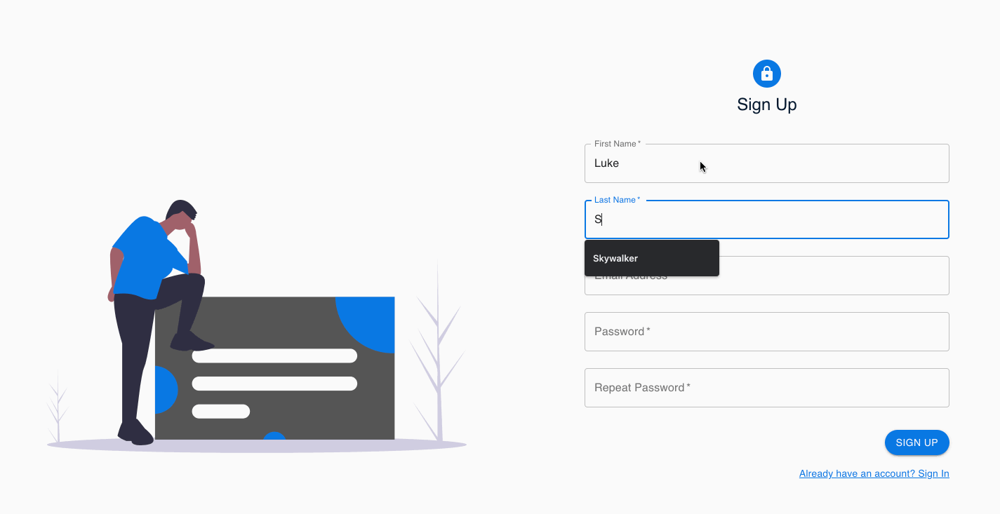

## PostgreSQL Setup

The postgres server runs on the default port 5432 for all platforms

### MacOS

1. Install [Homebrew](https://brew.sh/)
1. Install postgres using Homebrew: `brew install postgresql`
1. Start the postgres server: `pg_ctl -D /usr/local/var/postgres start`
1. Create the postgres role: `/usr/local/opt/postgres/bin/createuser -s postgres`
1. Create the database: `createdb sira`
1. Initialize the database with init.sql: `psql sira -f init.sql`
1. When finished running, stop the server: `pg_ctl -D /usr/local/var/postgres stop`

### Windows

1. Install [PostgreSQL 13.2](https://www.enterprisedb.com/downloads/postgres-postgresql-downloads)
1. Navigate to the postgres bin folder in cmd
1. Start the postgres server: `pg_ctl -D "C:\...\PostgreSQL\13\data" start`
1. Open psql and enter the credentials for user postgres set in installation: `psql -U postgres`
1. Create, connect to, and initialize the database with init.sql: `\i init.sql`
1. When finished running, stop the postgres server: `pg_ctl -D "C:\...\PostgreSQL\13\data" stop`

## Dependencies Setup

Run the following script to install the necessary server and client side dependencies.

```
npm install && npm run setup
```

## Run the application

Run the following script to start both backend and frontend servers

```
npm run dev
```

- Backend server runs on [localhost:8080](http://localhost:8080)
- Frontend server runs on [localhost:3000](http://localhost:3000)


## How to use the app:

1. Create an account.
2. Log in.
3. Create a new group and add members to your group by entering their emails. Feel free to create multiple groups and move between them.
4. Create a new task and set its current status.
5. Change the status of a task by clicking on the "Move Task" button to move it from 1 section to another (e.g. from "To Do" to "In Progress").
6. Click on the chat widget in the bottom-left corner to chat with your fellow group members.


### App Walkthough GIF


